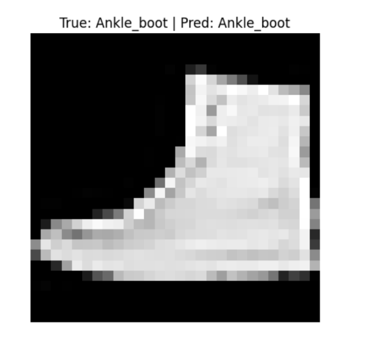

# EXP-3: Load a small set of labelled images from disk and train a simple CNN for classification

### 1. Introduction

A Convolutional Neural Network (CNN) is a deep learning model commonly used for image classification and computer vision tasks. 
CNNs automatically learn important features from images such as edges, textures, shapes, and patterns.

In this experiment, a CNN is used to classify Fashion-MNIST images into 10 different classes.

---

### 2. Fashion-MNIST Dataset

Fashion-MNIST is an image classification dataset containing grayscale images of clothing and fashion items.

Each image has a resolution of:

- Image size: **28 × 28 pixels**
- Number of channels: **1 (grayscale)**
- Number of classes: **10**

The classes are represented by labels from **0 to 9**.

The images are normalized before training by scaling pixel values from the range **0–255** to **0–1**.

---

### 3. Convolutional Layer

A convolutional layer applies learnable filters (kernels) to an input image.

The filters move across the image and perform convolution operations to detect local features such as:

- Edges
- Lines
- Corners
- Textures
- Shapes

In this experiment:

**First convolutional layer:**
- 32 filters
- 3 × 3 kernel
- ReLU activation

**Second convolutional layer:**
- 64 filters
- 3 × 3 kernel
- ReLU activation

As the network goes deeper, the layers learn increasingly complex features.

---

### 4. ReLU Activation Function

ReLU (Rectified Linear Unit) is used as the activation function in the convolutional and dense layers.

The function is:

$$\text{ReLU}(x) = \max(0, x)$$

It converts negative values to zero while keeping positive values unchanged.

ReLU helps the neural network learn non-linear relationships efficiently.

---

### 5. Max Pooling

Max pooling reduces the spatial dimensions of feature maps while retaining the most important information.

In this experiment:

Pool size = 2 × 2

For every 2 × 2 region, the maximum value is selected.

**Benefits of max pooling:**

- Reduces computational cost
- Reduces the size of feature maps
- Helps retain important features

---

### 6. Flatten Layer

After the convolutional and pooling layers, the resulting `feature maps are converted into a one-dimensional vector` using the Flatten layer.

This allows the extracted image features to be passed to the fully connected dense layers.

---

### 7. Dense Layer

Dense layers perform classification using the features extracted by the convolutional layers.

The model uses:

- Dense layer: **128 neurons**
- Activation: **ReLU**

The final dense layer contains a number of neurons equal to the number of classes.

For Fashion-MNIST:

 **10 output neurons**

---

### 8. Softmax Activation

The final layer uses the Softmax activation function.

Softmax converts the output values into probabilities for the 10 classes.

The class with the highest probability is selected as the predicted class.

**Example:**

| Class | Probability |
|-------|-------------|
| 0     | 0.02        |
| 1     | 0.01        |
| 2     | 0.04        |
| ...   | ...         |
| 9     | 0.85        |

The model predicts Class 9 because it has the highest probability.

---

### 9. Loss Function

The model uses **categorical cross-entropy** as the loss function.

It measures the difference between the actual class and the predicted probability distribution.

A lower loss indicates that the predictions are closer to the actual labels.

---

### 10. Adam Optimizer

The Adam optimizer is used to update the weights of the neural network during training.

Adam combines ideas from:

- Momentum
- Adaptive learning rates

It efficiently adjusts the model parameters to minimize the loss function.

---

### 11. Training and Validation

The dataset is divided into training and validation data.

- **Training data** → Used to learn model parameters
- **Validation data** → Used to evaluate the model during training

### 12. Result

