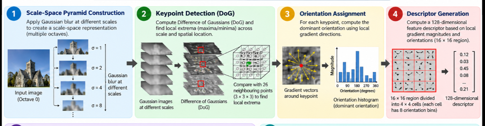
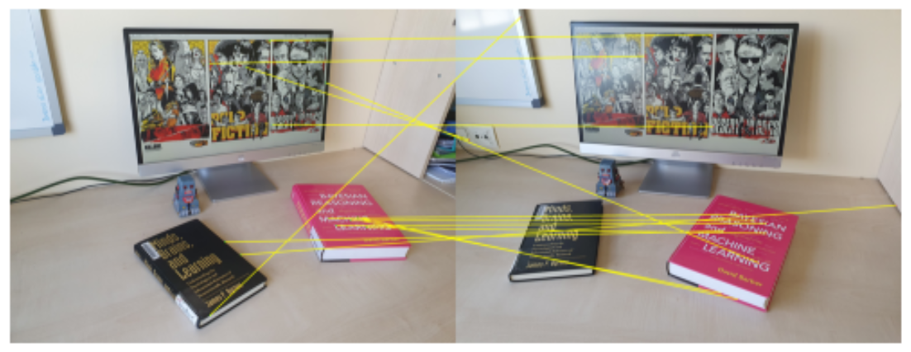

# Prg 4: Detect and match features in two images. Use SIFT

## Theory

### 1. **What is SIFT?**

**SIFT (Scale-Invariant Feature Transform)** is a computer vision algorithm for identifying distinctive keypoints in an image that are invariant to scale, rotation, and illumination changes, making it robust for matching features across different images.

### 2. **Why SIFT?**

Traditional pixel-based image matching fails when images undergo transformations like:

- **Scaling** (zoom in/out)
- **Rotation** (tilted perspectives)
- **Illumination changes** (lighting variations)
- **Viewpoint changes** (different camera angles)

SIFT overcomes these limitations by extracting features that remain consistent regardless of these transformations.

### 3. **SIFT Pipeline**

SIFT consists of four main stages:

cv2.SIFT_create() internally creates this pipeline

---

### 4. **Feature Matching**

Once keypoints and descriptors are extracted from both images:

#### **Brute Force Matching**

- Compares the descriptor of each keypoint in image 1 with all descriptors in image 2
- Uses **Euclidean distance (L2 norm)** to measure similarity
- Selects matches with the smallest distance (most similar descriptors)
- **crossCheck=True**: Ensures bidirectional consistency—a match is valid only if both keypoints mutually match

#### **Keypoint Matching**

Each match contains:

- queryIdx -> keypoint index in Image 1
- trainIdx -> keypoint index in Image 2

---

### 5. **Visualization**

The matched features are visualized by:

1. **Placing images side-by-side** on a canvas
2. **Drawing lines** connecting matched keypoints across the two images
3. **Marking keypoints** with circles:
   - Green circles: keypoints in image 1
   - Red circles: keypoints in image 2
4. **Bright yellow lines** connect corresponding matched features

This visualization helps verify that the algorithm correctly identified similar regions across both images.

---

### 6. **Applications**

SIFT and similar feature-based methods are used in:

- **Image stitching** (panorama creation)
- **Object recognition and detection**
- **Visual SLAM** (Simultaneous Localization and Mapping)
- **Image retrieval** and search

---

### Results

### Image Source

The images used in this experiment were obtained from:

J. Rico (2021), _SIFT feature matching using OpenCV_.

Source: [GitHub Repository](https://github.com/jvirico/sift-feature-matching)
