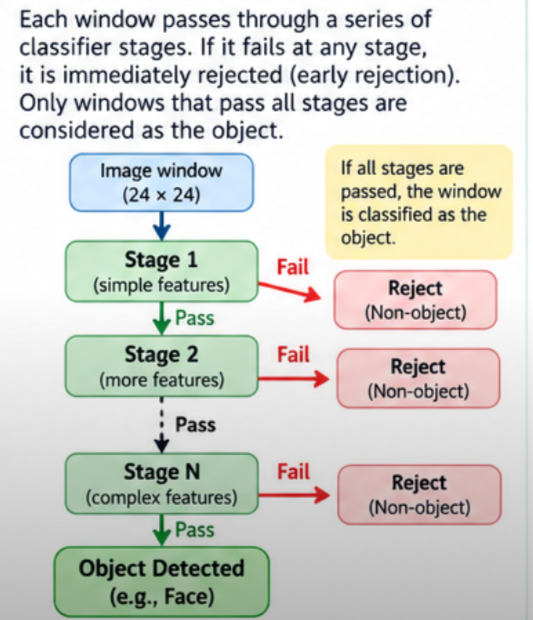
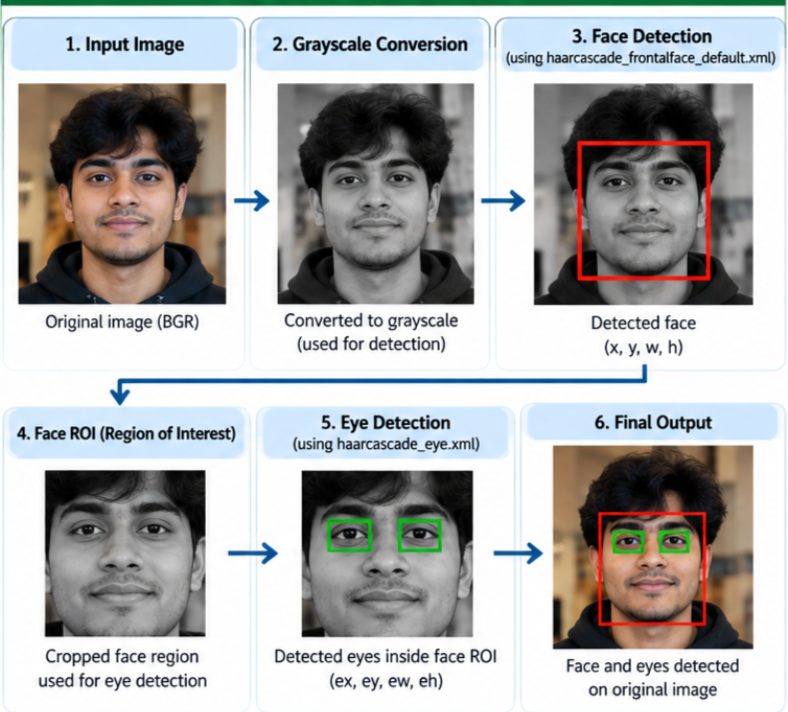

# Experiment 3 – Face and Eye Detection using Haar Cascade

## Aim

To use pretrained Haar Cascade classifiers to detect faces and eyes in an image using OpenCV.

---

## Libraries Used

- Python
- OpenCV (`cv2`)
- Matplotlib

---

## Theory

### 1. Haar Cascade

Haar Cascade is a machine-learning-based object detection technique used to detect objects such as faces and eyes.<br>
First ever method introduced to detect faces and objects


OpenCV provides pretrained Haar Cascade classifiers, so the classifiers do not need to be trained manually for this experiment.

The classifiers used are:

```text
haarcascade_frontalface_default.xml
haarcascade_eye.xml
```

---
### 2. Haar-like Features

Haar-like features are simple rectangular features used to identify patterns based on differences in pixel intensity.


---

### 3. Sliding Window

The window moves across the image and checks each region for object-like patterns.<br>
A typical Haar Cascade classifier uses a small detection window such as 24 × 24 pixels.

---

## What is a Cascade?

Instead of applying hundreds of complicated tests to every region, it uses a sequence of classifiers, called stages.
Because the classifiers are arranged like a series of stages.

## Cascade Classifier(Stages)




## Complete PipeLine



